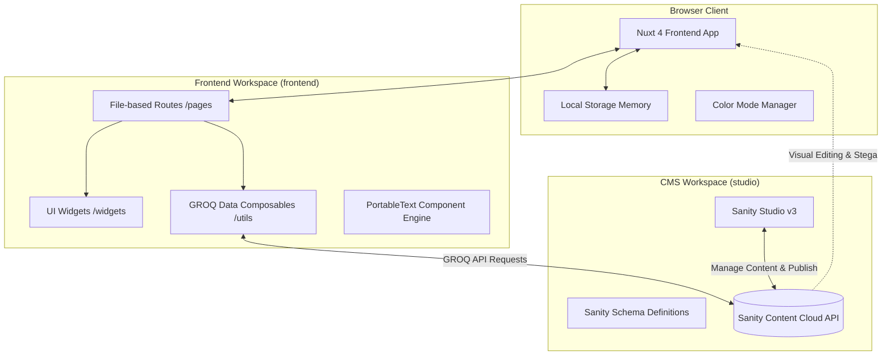
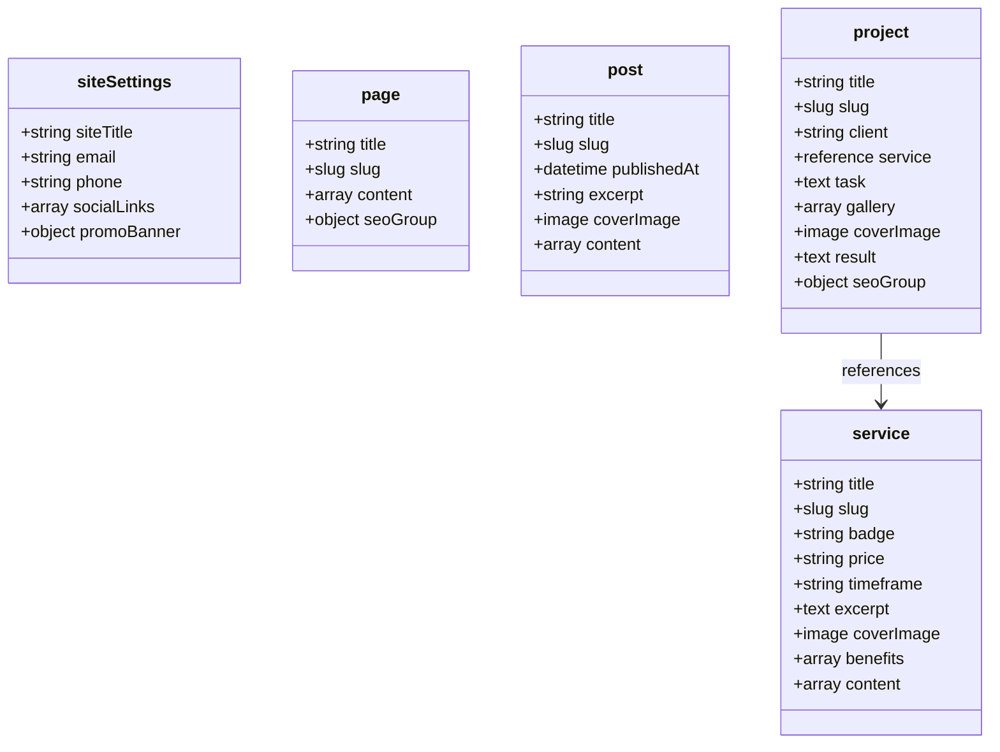

# Project Architecture & Feature Specifications

This document provides a comprehensive blueprint of the **Agency Website & Headless CMS** monorepo. It details the overall system architecture, project structure, backend content models, page router catalog, component & widget hierarchy, state management, and key interactive features.

---

## 1. Executive Summary & Tech Stack

The application is structured as a modern **Headless Web Application monorepo** consisting of a Nuxt 4 frontend consuming dynamic content from a Sanity Studio v3 CMS backend.

### Tech Stack Overview

| Layer | Technology | Version | Purpose |
| :--- | :--- | :--- | :--- |
| **Monorepo** | npm Workspaces + `npm-run-all2` | `^8.0.4` | Orchestrates joint execution of `frontend` and `studio` |
| **Frontend Framework** | Nuxt | `^4.5.0` | Server-Side Rendering (SSR), Hybrid Rendering & File-based Routing |
| **UI Library / Core** | Vue.js | `^3.5.40` | Reactive component architecture |
| **CMS Integration** | `@nuxtjs/sanity` | `^2.5.0` | Groq queries, client instantiation, Visual Editing & Stega integration |
| **Styling & Design System** | Tailwind CSS v4 + `@nuxtjs/tailwindcss` | `^4.3.3` | Utility-first responsive styling and typography |
| **Primitive Components** | shadcn-nuxt + Reka UI | `^2.8.0` | Accessible component primitives (Buttons, Cards, Inputs) |
| **Animations** | `@vueuse/motion` | `^3.0.3` | Micro-animations and entrance transitions |
| **Theme System** | `@nuxtjs/color-mode` | `^4.0.1` | Dark/Light mode theme toggle with persistent configuration |
| **Icons** | `@lucide/vue` | `^1.27.0` | Modern SVG icon library |
| **Rich Text Rendering** | `@portabletext/vue` | `^1.0.14` | Rendering Sanity Portable Text objects into Vue components |
| **Headless CMS Backend** | Sanity Studio | `^6.9.1` | Schema management, Content Studio UI, GROQ queries, Visual Editing |
| **Studio Framework** | React + Sanity Types | `^19.2.4` / `^6.7.0` | Host runtime for Sanity Studio schema tools |

---

## 2. System Architecture Diagram



---

## 3. Monorepo Directory Architecture

```
nuxt-sanity-agency-copy/
├── package.json                   # Root monorepo workspace definition
├── REQUIREMENTS.md                # Project requirements & ISR webhook docs
├── DEV.md                        # Development setup & component reference
├── ARCHITECTURE.md                # System architecture documentation (this file)
├── studio/                        # Workspace 1: Sanity Studio Backend
│   ├── package.json
│   ├── sanity.config.ts           # Studio configuration & plugins (Structure, Vision, Presentation)
│   ├── sanity.cli.ts              # Sanity CLI configuration
│   └── schemaTypes/               # Content models & object schemas
│       ├── index.ts               # Schema registry export
│       ├── page.ts                # Dynamic Page Builder schema
│       ├── post.ts                # Blog / Articles schema
│       ├── project.ts             # Portfolio Cases schema
│       ├── service.ts             # Agency Services schema
│       ├── siteSettings.ts        # Global Site Settings & Promo Banner schema
│       ├── blockContent.ts        # Portable text rich text schema
│       └── blocks/                # Custom Page Builder Block definitions
│           ├── heroBlock.ts
│           ├── featuresBlock.ts
│           ├── textImageBlock.ts
│           ├── ctaBlock.ts
│           └── logoMarqueeBlock.ts
└── frontend/                      # Workspace 2: Nuxt 4 Frontend Application
    ├── package.json
    ├── nuxt.config.ts             # Nuxt module configuration (Sanity, Tailwind, Motion, ColorMode)
    ├── components.json            # shadcn UI config
    └── app/
        ├── layouts/
        │   └── default.vue        # Global shell layout (Promo Banner + Header + Main + Footer)
        ├── pages/                 # File-based routing engine
        │   ├── index.vue          # Home page route (queries 'home' page slug)
        │   ├── [slug].vue         # Catch-all dynamic Page Builder route
        │   ├── contact.vue        # Contact Us form page
        │   ├── blog/
        │   │   ├── index.vue      # Blog articles directory
        │   │   └── [slug].vue     # Individual blog post article details
        │   ├── cases/
        │   │   ├── index.vue      # Portfolio cases directory
        │   │   └── [slug].vue     # Single portfolio case study page
        │   └── services/
        │       ├── index.vue      # Agency services catalog
        │       └── [slug].vue     # Single service details page
        ├── widgets/               # Page Builder & Layout Widgets
        │   ├── header.vue         # Global Header with navigation & theme toggle
        │   ├── footer.vue         # Global Footer with dynamic contacts & social links
        │   ├── promo-banner.vue   # Dismissable notification banner with localStorage keying
        │   ├── hero-block.vue     # Page Builder: Hero section
        │   ├── features-block.vue # Page Builder: Features grid section
        │   ├── text-image-block.vue # Page Builder: Text + Image split section
        │   ├── cta-block.vue      # Page Builder: Call to action section
        │   └── logo-marquee.vue   # Page Builder: Animated infinite logo marquee
        ├── components/
        │   ├── portable-text.vue  # Rich Text Renderer wrapper
        │   └── mark/              # Custom PortableText mark overrides
        │       ├── LinkMark.vue
        │       ├── UnderlineMark.vue
        │       ├── CodeMark.vue
        │       └── StrikethroughMark.vue
        ├── shared/
        │   ├── ui/                # UI primitives (Button, Card, Input, Form, Textarea, Label)
        │   └── lib/               # Utility scripts & helpers
        └── utils/
            └── sanityQueries.ts   # GROQ query composables (`usePage`, `usePost`, `useService`, etc.)
```

---

## 4. Pages & Routing Specification

The application features 9 distinct page routes organized logically within Nuxt's file-based router:

| Route Path | File Location | Purpose & Functionality | GROQ / Composables Used |
| :--- | :--- | :--- | :--- |
| `/` | `frontend/app/pages/index.vue` | Home Page. Fetches the page document with slug `home` and renders modular sections via the Page Builder. | `usePage('home')` |
| `/[slug]` | `frontend/app/pages/[slug].vue` | Catch-all dynamic page builder for arbitrary landing pages created in Sanity Studio. | `usePage(slug)` |
| `/blog` | `frontend/app/pages/blog/index.vue` | Blog index listing all published articles ordered by publish date descending. Features staggered entrance animations. | `usePosts()` |
| `/blog/[slug]` | `frontend/app/pages/blog/[slug].vue` | Single blog article view with custom PortableText rich text formatting (links, code, underline). | `usePost(slug)` |
| `/cases` | `frontend/app/pages/cases/index.vue` | Agency portfolio grid listing all completed projects with cover images, hover scaling, and client names. | `useProjects()` |
| `/cases/[slug]` | `frontend/app/pages/cases/[slug].vue` | In-depth case study showcasing project client, linked agency service, core task, image gallery with captions, and detailed results. | `useProject(slug)` |
| `/services` | `frontend/app/pages/services/index.vue` | Agency services directory showing service cards with badges, prices, timeframes, excerpts, and direct links. | `useServices()` |
| `/services/[slug]` | `frontend/app/pages/services/[slug].vue` | Dedicated service page with metadata summary card, "What's Included" benefits grid, related portfolio case studies, and nested Page Builder blocks. | `useService(slug)` |
| `/contact` | `frontend/app/pages/contact.vue` | Interactive client contact form (Name, Email, Message) with reactive submission state and alert feedback. | Form state (`reactive`) |

---

## 5. UI Widgets & Component Catalog

### 5.1 Global Layout Widgets

- **Global Layout (`frontend/app/layouts/default.vue`)**:
  Wraps all pages with the top `PromoBanner` (if enabled in CMS), sticky `Header`, main page view (`NuxtPage`), and dynamic `Footer`.
- **Header (`frontend/app/widgets/header.vue`)**:
  - Sticky glassmorphic top bar (`backdrop-blur-md`).
  - Displays site title dynamically pulled from `siteSettings`.
  - Links to Home, Portfolio, Services, Blog, About Us, and Contact.
  - Theme Toggle button switching between Light and Dark modes.
- **Footer (`frontend/app/widgets/footer.vue`)**:
  - Dynamic content powered by `siteSettings` schema.
  - Displays agency background text, email (`mailto:` link), phone (`tel:` link), and dynamic social links list.
  - Automatic copyright year generation.
- **Promo Banner (`frontend/app/widgets/promo-banner.vue`)**:
  - Top notification bar configured via Sanity `siteSettings.promoBanner`.
  - **Banner Types**: Supports `info`, `promo`, `announcement`, and `urgent` badge styles.
  - **Per-Banner Dismissal Persistence**: Computes a unique `bannerKey` based on content (`bannerType|message|ctaUrl`). When dismissed by clicking the close button, it stores `promoBannerDismissed_<bannerKey> = "true"` in `localStorage`. Updating the banner content in CMS automatically resets the visible state for all users.

### 5.2 Dynamic Page Builder Block Widgets

The Page Builder allows content managers to assemble rich custom pages in Sanity Studio by chaining modular blocks rendered seamlessly in Vue via PortableText component mappings:

1. **Hero Block (`frontend/app/widgets/hero-block.vue`)**:
   - High-impact top section with a soft background gradient (`from-primary/10 to-transparent`).
   - Large bold heading, subtitle, and primary Call-To-Action button routing to `/contact`.
2. **Features Block (`frontend/app/widgets/features-block.vue`)**:
   - Grid layout (3 columns on desktop) displaying core features/value propositions.
   - Staggered motion entrance animations for feature cards.
3. **Text & Image Block (`frontend/app/widgets/text-image-block.vue`)**:
   - Split section pairing formatted copy with a high-resolution image asset.
   - Configurable image orientation (`left` or `right` flex direction switch).
4. **CTA Block (`frontend/app/widgets/cta-block.vue`)**:
   - High-contrast primary call-to-action banner with radial gradient accent background.
   - Converts visitors to project inquiries.
5. **Logo Marquee (`frontend/app/widgets/logo-marquee.vue`)**:
   - Infinite horizontal scrolling marquee for client/partner logos.
   - Configurable scroll speed (e.g. `24s`), mask gradient edges for smooth fading, hover pause state, and automatic light/dark mode logo inversion.

---

## 6. Sanity CMS Content Schemas

The CMS backend consists of 5 document types and 5 custom object block types configured in `studio/schemaTypes`:

### Document Types



1. **`siteSettings`**: Global configuration (Site Title, Contact Email/Phone, Social Links array, Promo Banner settings).
2. **`page`**: Flexible Page Builder document containing metadata, SEO settings (`metaTitle`, `metaDescription`, `ogImage`), and an array of dynamic section blocks.
3. **`post`**: Blog articles with title, publish date, cover image, excerpt, and PortableText body content.
4. **`project`**: Agency portfolio case studies featuring client name, linked `service` document reference, task summary, image gallery with captions, cover image, result notes, and SEO group.
5. **`service`**: Agency services catalog detailing category badge, price, timeframe, brief excerpt, key benefits list, cover image, related portfolio cases (resolved via GROQ references), and page builder blocks.

---

## 7. Data Fetching & GROQ Query Layer

All queries to Sanity Cloud API are encapsulated into composables located in `frontend/app/utils/sanityQueries.ts`:

- **`usePage(slug)`**: Queries `*[_type == "page" && slug.current == $slug][0]` including image asset projection (`image.asset->url`) for `textImageBlock` and `logoMarqueeBlock`.
- **`useSiteSettings()`**: Retrieves the latest `siteSettings` document (site title, email, phone, social links, promo banner).
- **`usePosts()` & `usePost(slug)`**: Fetches blog post listings sorted by `publishedAt desc` and individual article detail views.
- **`useProjects()` & `useProject(slug)`**: Fetches portfolio cases ordered by creation date and detailed case study views with resolved `service` references (`service->`).
- **`useServices()` & `useService(slug)`**: Fetches agency service offerings and single service views including automatic reverse-reference lookup for related case studies (`*[_type == "project" && references(^._id)]`).

---

## 8. Development & Deployment Operational Commands

### Monorepo Workspaces

- **Start Monorepo (Parallel Dev Servers)**:
  ```bash
  npm run dev
  ```
  *(Launches Nuxt on `http://localhost:3000` and Sanity Studio on `http://localhost:3333` simultaneously)*

- **Run Frontend Only**:
  ```bash
  npm run dev:nuxt
  ```

- **Run Studio Only**:
  ```bash
  npm run dev:sanity
  ```

### On-Demand ISR Webhook Revalidation

For high-performance production hosting, Nuxt supports On-Demand ISR (Incremental Static Regeneration) cache invalidation via Sanity Webhooks configured at `/api/revalidate`. When content is published in Sanity Studio, Sanity posts a payload to Nuxt to clear Nitro's handler cache for affected post/project/page routes.
